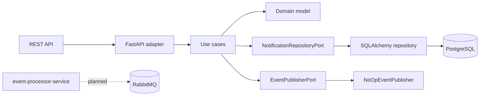

# Telecom Notification Service


I built this microservice to practice Python backend development with a
real-world telecom use case. The service receives network and service alerts,
stores them in PostgreSQL, and exposes a REST API to query notifications by
client, event type, and status.

I wanted the project to feel close to backend work I would do in a team, so I
used Hexagonal Architecture and kept FastAPI, SQLAlchemy, and messaging concerns
outside the domain and use case layers.

## Tech Stack

| Area | Technology |
| --- | --- |
| API | FastAPI |
| Validation | Pydantic v2 |
| Database | PostgreSQL |
| ORM | SQLAlchemy 2.0 async |
| Migrations | Alembic |
| Tests | pytest, pytest-asyncio, pytest-cov, testcontainers-python |
| Tooling | Ruff, Docker, Docker Compose, GitHub Actions |

## Architecture



## Run Locally

```bash
cp .env.example .env
docker compose up --build
```

The API runs at `http://localhost:8000`, and the interactive docs are available
at `http://localhost:8000/docs`.

## Run Tests

```bash
pip install -r requirements-dev.txt
ruff check .
pytest
```

Integration tests use `TEST_DATABASE_URL` when it exists. Otherwise, they start
a PostgreSQL container with testcontainers-python.

## API Endpoints

| Method | Path | Description |
| --- | --- | --- |
| `POST` | `/api/v1/notifications` | Create a notification |
| `GET` | `/api/v1/notifications` | List with filters and pagination |
| `GET` | `/api/v1/notifications/{id}` | Get one notification |
| `PATCH` | `/api/v1/notifications/{id}/status` | Update status |
| `DELETE` | `/api/v1/notifications/{id}` | Delete a notification |
| `GET` | `/health` | Health check |

Filters for `GET /api/v1/notifications`: `client_id`, `event_type`, `status`,
`limit`, and `offset`.

## Environment Variables

| Variable | Description |
| --- | --- |
| `APP_NAME` | Application name |
| `ENVIRONMENT` | Runtime environment |
| `API_PREFIX` | Versioned API prefix |
| `DATABASE_URL` | PostgreSQL URL used by the app |
| `POSTGRES_DB` | Local Docker database name |
| `POSTGRES_USER` | Local Docker database user |
| `POSTGRES_PASSWORD` | Local Docker database password |
| `RABBITMQ_DEFAULT_USER` | Local RabbitMQ user |
| `RABBITMQ_DEFAULT_PASS` | Local RabbitMQ password |
| `TEST_DATABASE_URL` | PostgreSQL URL for integration tests |

## Deploy to Render

This repository includes `render.yaml`, so it can be deployed from the Render
Dashboard as a Blueprint.

1. Push the repository to GitHub.
2. Open Render and choose **New > Blueprint**.
3. Connect the GitHub repository.
4. Review the web service and PostgreSQL database from `render.yaml`.
5. Click **Apply** and wait for the first deploy.
6. Open `/health` on the deployed URL to confirm the service is live.

Render injects `RENDER_EXTERNAL_URL` automatically. When that variable exists,
the app starts a small scheduler that pings `/health` every 10 minutes. Local
development is not affected.

Note: Render's free web services can sleep after 15 minutes without inbound
traffic, and free PostgreSQL databases currently have time and storage limits.
I would check Render's latest free-tier docs before using this for anything
important.

## UptimeRobot

As an extra free layer, I can add an UptimeRobot monitor at
`https://uptimerobot.com`. The monitor should call:

```text
https://<render-service-url>/health
```

Every 5 minutes is enough for a portfolio deployment.

## AWS EC2 + RDS

For AWS, I would deploy the API on an EC2 instance and use RDS PostgreSQL for
the database. The EC2 instance would run the app with Docker, receive traffic
through an Application Load Balancer, and store secrets in environment variables
or AWS Systems Manager Parameter Store.

The RDS security group should only allow PostgreSQL traffic from the EC2
security group. Migrations can run during deployment with `alembic upgrade head`.

## What I Learned

- Keeping SQLAlchemy outside the use cases makes the core easier to test.
- Async repositories need careful session handling to avoid hidden side effects.
- A small `NoOpEventPublisher` keeps the design ready for RabbitMQ later.
- Deployment details affect code, especially database URLs and health checks.

## Roadmap

- I plan to add a second `event-processor-service`.
- I plan to replace `NoOpEventPublisher` with a RabbitMQ adapter.
- I plan to publish notification lifecycle events for downstream processing.
- I plan to add pagination metadata and better API response envelopes.
